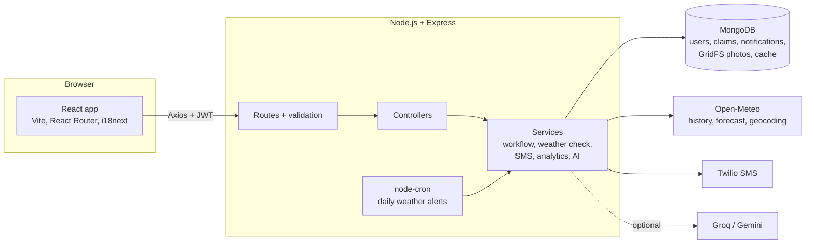
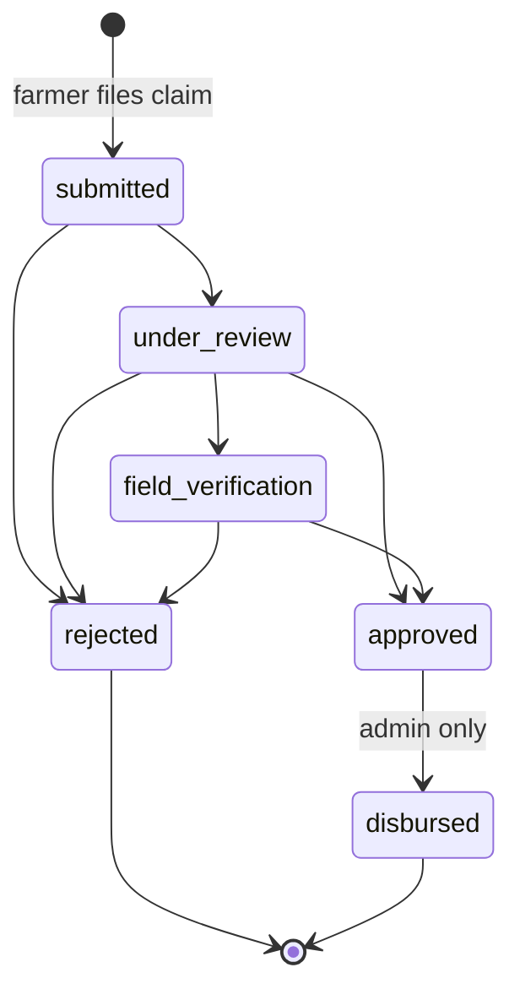

# Krishi Sahayata

A MERN-stack platform where farmers file and track crop-insurance claims, and field officers review them with the help of **real weather data**.

- Farmers log in with their **mobile number + OTP**, file a claim with photos and farm location, and get an **SMS in English or Hindi at every step**.
- Every claim is automatically **checked against recorded weather** (Open-Meteo) at the farm around the date of loss, e.g. a flood claim with almost no rain gets flagged.
- Officers work through claims with filters, bulk actions and overdue (SLA) tracking; admins see analytics built with **MongoDB aggregation pipelines**.

**Tech stack:** MongoDB (Mongoose) · Express.js 5 · React 18 (Vite) · Node.js · Axios · Twilio SMS · Open-Meteo API · node-cron · Jest + Supertest · Groq / Gemini (optional)

---

## Features

| Area | What it does |
| --- | --- |
| Authentication | Farmers: phone + 6-digit OTP (hashed, 5-minute expiry, 5 attempts, resend cooldown). Officers/admins: email + bcrypt password. JWT with role-based access (farmer / officer / admin). Rate limiting on login and OTP endpoints. |
| Claims | 4-step claim form (crop & loss, farm location via GPS or place search, bank details, photos). Claim numbers like `KS-2026-000042` from an atomic counter. Bank account number is never sent back to the browser, only the last 4 digits. |
| Claim lifecycle | A state machine: `submitted → under_review → field_verification → approved / rejected → disbursed`. Invalid jumps are refused; only admins can mark money as paid; officers can act only on claims assigned to them. Every change is stored in the claim's timeline. |
| Auto-assignment | New claims go to the active officer in the farmer's district with the fewest open claims. |
| SMS (Twilio) | SMS on every status change in the farmer's language (English / Hindi), with retries and a delivery log per claim. Works without Twilio too (messages are printed to the terminal). |
| Weather check | Uses Open-Meteo historical data at the farm location to score how well the weather supports the reported cause (drought, flood, excess rain, hailstorm, cyclone, heatwave, frost). Gives a 0-100 score, a verdict and plain-English reasons. Rainfall thresholds follow IMD categories. |
| Weather alerts | A daily node-cron job checks the 2-day forecast for every farm and texts farmers about heavy rain, extreme heat or strong wind. |
| Photos | Up to 3 photos per claim, stored in MongoDB **GridFS** (no paid file storage needed). File type checked by magic bytes; photos only visible to people who can see the claim. |
| Officer dashboard | Search, filters (status, cause, weather verdict, overdue, unassigned), sorting, pagination and bulk status updates. |
| Analytics | Claims per month / status / cause / state, approval rate, average days to decision, amount paid, weather verdicts, officer workload. |
| Public tracking | Anyone can check a claim's status with the claim number + last 4 digits of the phone number, no login needed. |
| Hindi | Full Hindi UI with an EN / हिं switch. |
| AI summary (optional) | Officers can generate a short summary of a claim with Groq (Llama 3.3 70B), falling back to Gemini. Only non-personal facts are sent. |

## How it works



### Claim lifecycle



### Weather check

When a claim is filed, the server looks up daily weather at the farm's coordinates for a window around the date of loss (e.g. 30 days before, for drought) and applies simple, explainable rules:

| Cause | What is checked |
| --- | --- |
| Drought | Total rain and number of dry days (< 2.5 mm) in the 30 days before the loss |
| Flood / excess rain | Highest 1-day and 3-day rainfall, total rain (IMD: heavy ≥ 64.5 mm, very heavy ≥ 115.6 mm) |
| Hailstorm | Thunderstorm weather codes and wind gusts (models don't report hail directly for India) |
| Cyclone | Maximum wind gusts (≥ 62 km/h) and heavy rain |
| Heatwave / frost | Maximum / minimum temperature |

Score ≥ 60 → *consistent*, 30-59 → *inconclusive*, < 30 → *inconsistent*. It is a signal for the officer, not an automatic decision. The rules use fixed thresholds, not each district's normal climate. See [`server/src/services/weatherScoring.js`](server/src/services/weatherScoring.js).

## Project structure

```
krishi-sahayata-mern/
├── server/                    Express + MongoDB API
│   ├── src/
│   │   ├── config/            environment variables, DB connection
│   │   ├── models/            Mongoose schemas (User, Claim, Notification, Otp, ...)
│   │   ├── routes/            URL -> validation -> controller
│   │   ├── controllers/       request handling
│   │   ├── services/          business logic (claim workflow, weather, SMS, analytics, AI)
│   │   ├── middleware/        auth, validation, uploads, rate limits, errors
│   │   ├── jobs/              daily weather-alert cron job
│   │   └── scripts/seed.js    demo data
│   └── tests/                 Jest unit + integration tests
├── client/                    React app (Vite)
│   └── src/
│       ├── pages/             Home, Login, farmer pages, staff pages
│       ├── components/        Navbar, badges, forms, weather widget, ...
│       ├── context/           logged-in user (AuthContext)
│       └── locales/           en.json, hi.json
└── docs/PROJECT_GUIDE.md      plain-language walkthrough of the code
```

## Run it locally

You need **Node.js 20.19+ (or 22 LTS)** and a MongoDB database. The easiest is a free **MongoDB Atlas** cluster (M0); a local MongoDB also works.

```bash
# 1. Install dependencies
npm run install:all

# 2. Configure the server
cd server
copy .env.example .env        # Windows (use "cp" on macOS/Linux)
# edit .env: set MONGO_URI and JWT_SECRET (Twilio keys are optional)

# 3. Load demo data (needs internet for the weather checks)
npm run seed

# 4. Start the API (terminal 1)
npm run dev                   # http://localhost:5000

# 5. Start the React app (terminal 2)
cd ../client
npm run dev                   # http://localhost:5173
```

### Demo accounts (after `npm run seed`)

| Role | Login |
| --- | --- |
| Farmer | Mobile `9999900001` (the OTP is shown on screen for demo accounts) |
| Field officer | `puri.officer@krishisahayata.in` / `Officer@12345` (also `khordha`, `nalanda`, `bokaro`, `nashik`) |
| Admin | `admin@krishisahayata.in` / `Admin@12345` |

Seeded accounts use made-up phone numbers and never receive real SMS.

### Environment variables (`server/.env`)

| Variable | Required | Purpose |
| --- | --- | --- |
| `MONGO_URI` | yes | MongoDB connection string |
| `JWT_SECRET` | yes | Secret for signing login tokens (long random string) |
| `CLIENT_URL` | for deployment | Frontend URL(s) allowed by CORS, comma-separated |
| `TWILIO_ACCOUNT_SID`, `TWILIO_AUTH_TOKEN`, `TWILIO_PHONE_NUMBER` | no | Real SMS. Without them, SMS and OTPs are printed in the server terminal |
| `DEMO_MODE` | no | `true` shows OTPs on screen (for a public demo) |
| `GROQ_API_KEY`, `GEMINI_API_KEY` | no | Enables AI claim summaries |
| `SLA_DAYS` | no | Days before an unchanged open claim counts as overdue (default 7) |
| `WEATHER_ALERT_CRON` | no | Schedule for weather alerts (default `0 6 * * *` = 6 AM IST), `off` to disable |

## Tests

```bash
cd server
npm test
```

73 tests: unit tests for the claim state machine, weather scoring, weather alerts and phone parsing; integration tests (Supertest) for OTP login, permissions, claim filing, photo upload security, status changes with SMS, bulk updates, filters, public tracking, the weather check and analytics. Tests use an in-memory MongoDB (downloaded automatically on the first run) and mock Open-Meteo, so they don't need internet or Twilio.

## API overview

| Method | Endpoint | Who |
| --- | --- | --- |
| POST | `/api/auth/otp/request`, `/api/auth/otp/verify` | public (farmers) |
| POST | `/api/auth/staff/login` | public (staff) |
| GET / PATCH | `/api/auth/me` | logged in |
| GET / POST | `/api/claims` | list (scoped by role) / file a claim (farmer, multipart) |
| GET | `/api/claims/:id` | owner, assigned officer, admin |
| PATCH | `/api/claims/:id/status` | officer, admin |
| POST | `/api/claims/bulk/status` | officer, admin |
| PATCH | `/api/claims/:id/assign` | admin |
| POST | `/api/claims/:id/weather-check`, `/api/claims/:id/ai-summary` | officer, admin |
| GET | `/api/files/:fileId` | anyone who can see the claim |
| GET | `/api/weather/forecast`, `/api/weather/places` | logged in |
| POST | `/api/weather/alerts/run` | admin |
| GET | `/api/analytics/summary`, `/api/analytics/officers` | officer / admin |
| GET / POST / PATCH | `/api/users`, `/api/users/staff`, `/api/users/:id` | admin |
| GET | `/api/public/track?claimNumber=&phoneLast4=` | public |

## Known limitations

- The weather check uses fixed thresholds rather than each district's normal rainfall, and weather-model data covers grid cells several kilometres wide rather than a single field, so it is a hint for officers, not proof.
- A Twilio trial account can only send SMS to phone numbers verified in the Twilio console.
- The free MongoDB Atlas tier has 512 MB of storage, which limits how many photos can be stored.
- The login token is kept in `localStorage`; an httpOnly cookie would be safer against XSS but needs extra CSRF handling across domains.

## History

Version 1 was a Node.js + Express prototype that read claims from a JSON file and checked weather for a fixed date. Version 2 is a full rewrite as a MERN application.

## License

MIT
